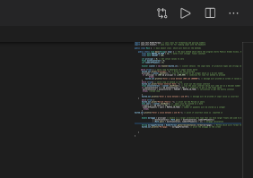
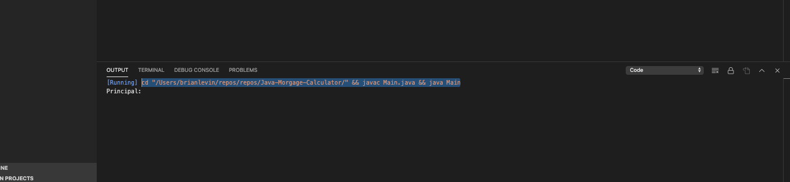
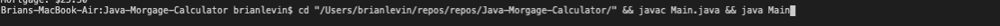
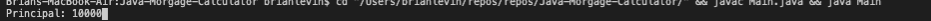
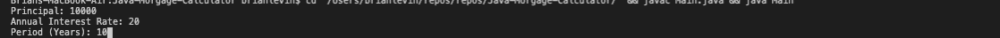
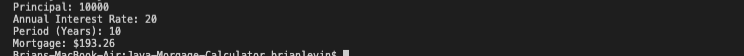
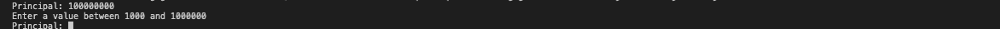
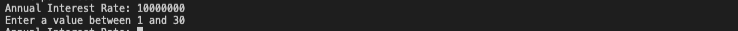
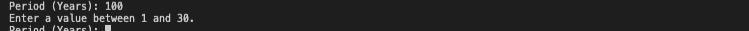

# Java-Mortgage-Calculator

## Description

The Java Mortgage Calculator is a simple application that allows the user  to calculate their mortgage based off of the data they put in. The mortgage is calculated based off of the principle or the loan the user wants, the  annual interest rate of the loan, and the period in years the loan will be paid off.  The mortgage is then calculated in the monthly payments which will be paid  and then displays it as a currency.

## Click [here](https://drive.google.com/file/d/1bJZZEHpAiu2r6HxI6X-KpxIrGJALdkJu/view?usp=sharing)  to view the app. 

To get the output in Visual Studio Code, download the right extentions and click the play button on the top right on the screen: 

 
 
 Once the Java is running and output the data, copy  the data and paste it in the terminal:
 
 
  
 
   
  
  The terminal will then ask you one prompt at a time to put in  the: principle, annual interest rate, and the period in years the user wants to pay off loan:
   
   
   
 
 
 
   
 
 The mortgage monthly payments  is then calculated:
 
    
 
 Make sure the right values are typed in otherwise the user will get these messages:
 

  

  

 

## Libraries and Frameworks:

- Java  
   
## Email:

        bml201095@gmail.com

